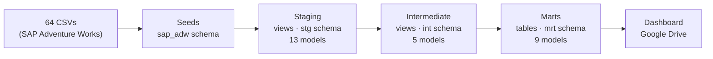

# Adventure Works Analytics — dbt + BigQuery


End-to-end analytics engineering project built on **dbt Core** and **BigQuery**.
Transforms raw SAP Adventure Works data into a star-schema data mart, covering
the full analytics lifecycle: ingestion → staging → intermediate → marts → dashboard.

**[Dashboard](https://drive.google.com/file/d/1P5sIFxPpFo0O0Vb3xIx0Xd5AipQMJtO5/view?usp=sharing)** · **[Conceptual Model](https://drive.google.com/file/d/1ltGTRQKS7peliVuWBNowrY_ltx8IU8oJ/view?usp=sharing)**

---

## Architecture



### Star Schema

```
                    dim_data
                       │
dim_localidade ── fato_vendas ── dim_produto
                       │
dim_clientes      dim_cartao
                       │
             bridge_motivo_venda ── dim_motivo_venda
```

`fato_vendas` — grain: one row per order line item.

`mart_performance_cliente` — analytical aggregate: revenue, order frequency,
customer lifetime window, and revenue quartile segmentation (NTILE 4).

---

## Stack

| Tool | Version | Role |
|---|---|---|
| dbt Core | ≥ 1.9 | transformation |
| dbt-bigquery | ≥ 1.9 | BigQuery adapter |
| dbt_utils | 1.0.0 | `date_spine`, `generate_surrogate_key` |
| BigQuery | — | data warehouse |
| SQLFluff | ≥ 3 | SQL linting |
| uv | latest | Python dependency management |

---

## Setup

### Prerequisites
- Python 3.11+
- [uv](https://docs.astral.sh/uv/)
- Google Cloud project with BigQuery enabled
- Service account key with BigQuery Data Editor + Job User roles

### Installation

```bash
git clone https://github.com/danielmschaves/academy-dbt-test.git
cd academy-dbt-test

# Install Python dependencies (creates .venv automatically)
uv sync

# Activate virtual environment
source .venv/bin/activate          # Linux/macOS
.venv\Scripts\activate             # Windows
```

### BigQuery credentials

1. Download your service account key (`.json`) from Google Cloud Console.
2. Place it at `temp/<your-keyfile>.json`.
3. Edit `profiles.yml` in the project root:

```yaml
academy_dbt_test:
  target: dev
  outputs:
    dev:
      type: bigquery
      method: service-account
      project: <your-gcp-project>
      dataset: academy_dbt_prod
      keyfile: temp/<your-keyfile>.json
      location: US
```

4. Verify the connection:

```bash
make debug
```

---

## Commands

| Command | Description |
|---|---|
| `make install` | Install Python deps with uv |
| `make deps` | Install dbt packages |
| `make seeds` | Load all 64 seed CSVs into BigQuery |
| `make build` | Build all models (compile + run + test) |
| `make test` | Run all dbt tests |
| `make docs` | Generate + serve docs at http://localhost:8080 |
| `make full-build` | deps → build → test → docs |
| `make build_stg` | Build staging layer only |
| `make build_int` | Build intermediate layer only |
| `make build_marts` | Build marts layer only |
| `make run_fact` | Build `fato_vendas` only |
| `make lint` | Lint SQL with SQLFluff |
| `make fix` | Auto-fix SQL style with SQLFluff |
| `make full-refresh` | Force-rebuild all incremental models |

**Single model:**
```bash
dbt build --select <model_name>
dbt test  --select <model_name>
```

> **Note:** `dbt seed` may hang after loading all 64 tables — restart the terminal if it does not return.

---

## Project Structure

```
models/
├── staging/sap/        # 13 models — rename + type-cast SAP sources
├── intermediate/       # 5 models  — joins, business calculations, window functions
└── marts/              # 9 models  — star schema (fact + dimensions + analytics)
seeds/sap_adventure_works/
├── human_resources/
├── person/
├── production/
├── purchasing/
└── sales/              # 64 CSVs total → sap_adw schema
```

---

## Key Design Decisions

- **Surrogate keys** generated with `dbt_utils.generate_surrogate_key`.
- **Column naming**: uppercase Portuguese throughout (`SK_CLIENTE`, `VALOR_BRUTO`).
- **Date dimension** built with `dbt_utils.date_spine` (2011–2014) — continuous calendar, no gaps.
- **Window functions** in `int_vendas_metricas`: purchase sequence, cumulative revenue, days between orders, product value ranking.
- **Customer segmentation** in `mart_performance_cliente`: NTILE quartiles over total revenue.
- `profiles.yml` lives in the project root (not `~/.dbt/`) for portability.
